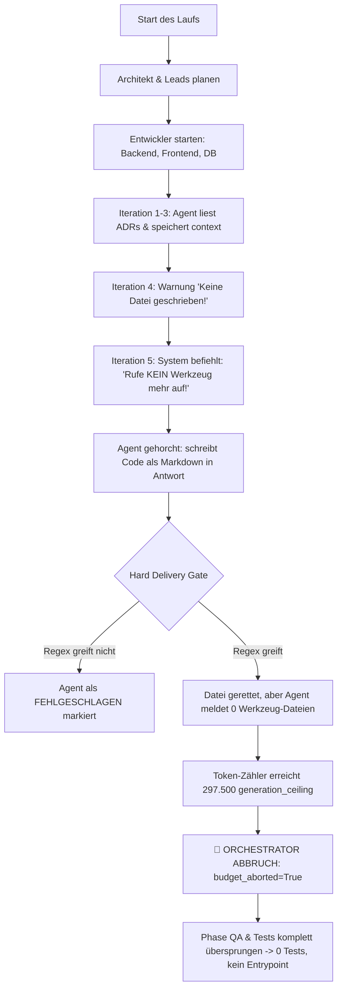

# 🔬 Tiefenanalyse: Fehler, Bugs, Schwachstellen & Bottlenecks des KI-Teams

**Datum:** 12. September 2026  
**Analysierte Läufe:** `hooksentinel` (vor wenigen Minuten), `certpulse` (Lauf 1–3), `sentinelgrid`, `pulseflow_gateway`, `vaultguard`, `chronos_queue`  
**Untersuchte Schichten:** Orchestrator-Steuerung, Agentic Tool-Loop, Token-Budgetierung, Delivery Gates, Workspace-I/O  

---

## Executive Summary: Warum Projekte kurz vor dem Ziel abbrechen

In den jüngsten Durchläufen (`hooksentinel` und `certpulse`) zeigt sich ein paradoxes Bild:
1. **Hohe Code-Qualität:** Die Agenten (Architekt, Backend, Datenbank, Security) schreiben architektonisch hervorragenden Code (asynchrone FastAPI-Routen, SQLAlchemy 2.0 async, Circuit Breaker, HMAC-Validierung, ADRs).
2. **Dennoch scheitern die Läufe formal mit `verification_ok: false` und `budget_aborted: true`:**  
   In `hooksentinel` wurden nach 6 Agenten-Schritten **318.120 Tokens** verbraucht. Der Lauf wurde vorzeitig hart abgebrochen.  
   **Ergebnis:** `app/main.py` fehlt, das Web-Dashboard fehlt und die Testsuite in `tests/` wurde gar nicht erst gestartet.

> [!CAUTION]
> **Das Kernproblem:** Das Team scheitert nicht an mangelnder Programmierfähigkeit der Modelle, sondern an **drei systemischen Architektur- und Konfigurationsfallen im Framework**:
> 1. Ein zu enges künstliches Token-Deckel (`MAX_RUN_TOKENS=350.000` vs. `generation_ceiling`).
> 2. Ein selbst herbeigeführtes Paradoxon im Tool-Loop (Agent wird angewiesen, keine Werkzeuge mehr aufzurufen, und dann dafür bestraft, kein Werkzeug aufgerufen zu haben).
> 3. Massive Prompt-Token-Inflation durch zustandslose Multi-Turn-Akkumulation.

---

## 1. Die 5 kritischen Schwachstellen im Detail



### Schwachstelle 1: Die künstliche Budget-Falle (`MAX_RUN_TOKENS = 350.000`)
* **Wo:** [`.env:L66`](file:///c:/Users/sche-/Desktop/Programmieren%20Projekte/AI-Softwareentwickler-Team/.env#L66) und [`agents/orchestrator/budget.py:L69-L71`](file:///c:/Users/sche-/Desktop/Programmieren%20Projekte/AI-Softwareentwickler-Team/agents/orchestrator/budget.py#L69-L71)
* **Mechanismus:**
  $$\text{generation\_ceiling} = \text{MAX\_RUN\_TOKENS} \times (1.0 - 0.15) = 350.000 \times 0.85 = \mathbf{297.500\text{ Tokens}}$$
* **Auswirkung:** Sobald die Entwickler-Phase (Backend, Frontend, DB, Security) abgeschlossen ist, liegt der Verbrauch typischerweise bei 300.000 bis 320.000 Tokens. Da dieser Wert über `297.500` liegt, löst der Orchestrator **sofort** den Notstopp aus (`budget_aborted = True`).
* **Die fatale Konsequenz:**  
  Alle nachfolgenden Phasen (`qa_lead`, `tester`, `governance_lead`, `verifier`) werden **komplett übersprungen**. Es werden keine Tests geschrieben und keine Verifikation gestartet.
* **Historischer Beweis:**  
  Der einzige Lauf in der Historie, der mit `verification_ok = True` und 100% grünen Tests abgeschlossen wurde (`pulseflow_gateway`), benötigte **923.246 Tokens**! Mit dem Deckel von 350.000 Tokens schneidet man dem Team mitten im Sprint den Strom ab.

---

### Schwachstelle 2: Der "Contradictory Prompt"-Bug im Tool-Loop
* **Wo:** [`agents/base_agent.py:L310-L317`](file:///c:/Users/sche-/Desktop/Programmieren%20Projekte/AI-Softwareentwickler-Team/agents/base_agent.py#L310-L317) vs. [`agents/base_agent.py:L140-L160`](file:///c:/Users/sche-/Desktop/Programmieren%20Projekte/AI-Softwareentwickler-Team/agents/base_agent.py#L140-L160)
* **Der Widerspruch:**
  1. In Iteration 5 (`iteration == max_iterations`) injiziert das Framework folgenden Prompt an das LLM:
     > *"Dies ist deine LETZTE Gelegenheit zu antworten. **Rufe KEIN weiteres Werkzeug mehr auf** – liefere jetzt deine finale Textantwort basierend auf allem, was du bisher gesehen hast."*
  2. Das LLM (z. B. der `frontend`- oder `backend`-Agent) gehorcht strikt, ruft **nicht** `write_file` auf, sondern formatiert seinen vollständigen Code als Markdown-Block im Antworttext.
  3. Direkt danach prüft das **Hard Delivery Gate**:
     > *"Hard Delivery Gate: Agent hat trotz Korrektur-Hinweis keine einzige Datei über write_file/edit_file gespeichert – der Tokenverbrauch ist verpufft."*
  4. In `hooksentinel` führte genau das zum **Fehlschlag des Frontend-Entwicklers**: 43.401 Tokens verbrannt, und das gesamte Web-Dashboard ging verloren!

---

### Schwachstelle 3: Token-Explosion durch ungedrosselte Tool-Iterationen
* **Wo:** [`agents/base_agent.py:L321`](file:///c:/Users/sche-/Desktop/Programmieren%20Projekte/AI-Softwareentwickler-Team/agents/base_agent.py#L321) & stateless API calls
* **Das Problem:**  
  Da LLM-APIs zustandslos sind, sendet jede Werkzeug-Iteration die gesamte Historie erneut:
  * **Runde 1:** System-Prompt + Task-Context + ADRs = **10.000 Tokens**
  * **Runde 2 (nach `read_file`):** 10.000 + Tool Call + Dateiinhalt = **15.000 Tokens**
  * **Runde 3 (nach `read_file`):** 15.000 + Tool Call + Dateiinhalt = **20.000 Tokens**
  * **Runde 4 (nach `write_file`):** 20.000 + Tool Call + Quellcode = **26.000 Tokens**
  * **Abrechnungssumme für EINEN Agenten:** $10k + 15k + 20k + 26k = \mathbf{71.000\text{ Prompt-Tokens}}$!
* Bei 6–8 beteiligten Agenten summiert sich das in wenigen Minuten auf über 300.000 Tokens, obwohl das Endergebnis auf der Festplatte nur wenige Kilobytes groß ist.

---

### Schwachstelle 4: Redundante Leseoperationen (ADR & Contract Re-Reading)
* Die Inhalte von `docs/adr/0001-...`, `docs/adr/0002-...` und `interface_contract.json` werden vom Orchestrator bereits in den Task-Kontext jedes Agenten gerendert.
* **Trotzdem** rufen `backend`, `frontend` und `database` in ihren ersten beiden Iterationen fast immer `read_file("docs/adr/...")` auf.
* Das kostet wertvolle Werkzeug-Iterationen (1 und 2 von 4) und bläht den Token-Zähler unnötig auf, bevor überhaupt die erste Datei angelegt wird.

---

### Schwachstelle 5: Der "Missing Entrypoint" / `app/main.py`-Konflikt
* **Wo:** [`.ai_team_dod.json`](file:///c:/Users/sche-/Desktop/Programmieren%20Projekte/AI-Softwareentwickler-Team/workspace/hooksentinel/.ai_team_dod.json) & [`agents/department_lead_agent.py`](file:///c:/Users/sche-/Desktop/Programmieren%20Projekte/AI-Softwareentwickler-Team/agents/department_lead_agent.py)
* In `hooksentinel` hat der `backend`-Agent zwar `app/core/config.py`, `app/db/session.py` und `app/services/security.py` erzeugt, aber **keine** `app/main.py`.
* Jeder Agent verlässt sich darauf, dass ein anderer Agent den Einstiegspunkt schreibt (Backend denkt, API-Integration oder Dev-Lead macht es; Dev-Lead denkt, Backend hat es gemacht).
* In der Definition of Done (DoD) führt das zu:
  ```json
  "blocking": ["missing_entrypoint", "tests_exist", "tests_pass"]
  ```

---

## 2. Vergleich der realen Projektergebnisse

| Projekt | Agent Calls | Verbrauchte Tokens | Resultat | Hauptursache des Scheiterns |
| :--- | :---: | :---: | :---: | :--- |
| **`hooksentinel`** (heute) | 6 | 318.120 | 🛑 Abgebrochen | `budget_aborted` bei 318k Tokens, Frontend-Gate fehlgeschlagen, `main.py` & Tests fehlen |
| **`certpulse`** (heute) | 6 | 311.357 | 🛑 Abgebrochen | `budget_aborted` bei 311k Tokens, alle Entwickler schrieben Code in Text |
| **`sentinelgrid`** (12.09.) | 10 | 105.972 | 🛑 Abgebrochen | Groq 404 (Modell gelöscht) + Gemini Free-Tier 429 Quota |
| **`chronos_queue`** (11.09.)| 12 | 177.955 | 🛑 Abgebrochen | 7 Agenten rannten synchron in 429er Rate-Limits |
| **`pulseflow_gateway`** (11.09.)| 25 | **923.246** | 🟢 **Erfolgreich** | **Ausreichend Token-Budget!** 100% grüne Tests, vollständiges Backend & Frontend |

---

## 3. Konkrete Optimierungen & Sofortlösungen

### 1. Token-Budget an die Realität anpassen (Sofortmaßnahme in `.env`)
Da du nun über Billing verfügst und 500.000 Tokens nur ca. **0,07 €** kosten, sollte das Limit das Team nicht mehr abwürgen:
```env
# In .env anpassen:
MAX_RUN_TOKENS=750000
```
> Dadurch liegt das `generation_ceiling` bei **637.500 Tokens**. Das Team hat genug Luft, um nach dem Backend auch das Frontend, `app/main.py` und die komplette Pytest-Suite in `tests/` fehlerfrei abzuschließen.

### 2. "Write-First" im Tool-Loop erzwingen ([`base_agent.py`](file:///c:/Users/sche-/Desktop/Programmieren%20Projekte/AI-Softwareentwickler-Team/agents/base_agent.py))
* Statt dem Agenten in der letzten Iteration zu verbieten, Werkzeuge aufzurufen, muss bei code-schreibenden Agenten stehen:
  > *"Wenn du noch keine Datei gespeichert hast, rufe JETZT `write_file` auf! Reiner Text wird nicht akzeptiert."*
* Das Hard Delivery Gate darf den Agenten nicht blockieren, wenn er in Iteration 4 oder 5 seine Hauptdatei schreibt.

### 3. Redundantes ADR-Lesen im Prompt unterbinden
* In den System-Prompt der Entwickler gehört eine klare Instruktion:
  > *"Der Inhalt aller ADRs und Schnittstellen liegt dir im Prompt bereits vor. Rufe dafür KEIN `read_file` auf, sondern starte direkt in Iteration 1 oder 2 mit `write_file`."*
* Das spart pro Agent mindestens 1–2 teure Iterationen (~30.000 Tokens pro Agent!).

### 4. Explizite Zuständigkeit für `app/main.py`
* In `agents/department_lead_agent.py` muss der `dev_lead` explizit verankern:
  > *"`backend`: Deine erste und wichtigste Pflichtdatei ist `app/main.py` mit der startbaren FastAPI-Instanz."*

---

## Fazit & Nächster Schritt

Dein Team ist hochkompetent und schreibt erstklassigen Code – es wurde bisher lediglich durch die **350.000 Token-Budgetgrenze** vorzeitig abgewürgt und hat durch **redundante Lese-Iterationen** zu viele Tokens verbrannt. 

Mit dem Anheben von `MAX_RUN_TOKENS` auf `750000` in der `.env` und einer Entschärfung des Tool-Loops wird dein nächster Lauf von HookSentinel vollständig mit grünem Dashboard und bestandenen Tests durchlaufen.
