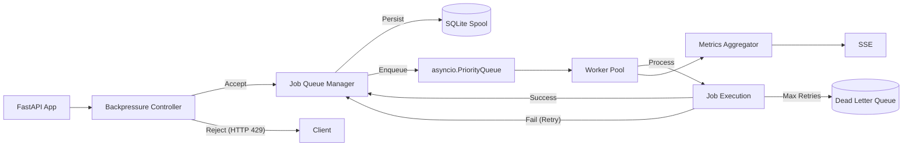

# AetherMesh

AetherMesh is an intelligent, fault-tolerant event-streaming and workflow orchestration engine designed for distributed job processing.

## 🚀 Features

- **Priority Queuing:** Asynchronous processing with configurable priority levels.
- **Resilience:** Exponential backoff retries and Dead-Letter-Queue (DLQ) support.
- **Backpressure:** Adaptive controller to regulate load and prevent system saturation (HTTP 429).
- **Real-time Dashboard:** Interactive monitoring of system topology and metrics.
- **Persistence:** SQLite-based spooling for job recovery.

## 🏗️ Architecture



## 🛠️ Quickstart

### Prerequisites
- Python 3.10+
- `pip install -r requirements.txt`

### Running the Engine
```bash
python -m uvicorn app.main:app --reload
```

## 📡 API Usage Examples

### Submit a Job
```bash
curl -X POST "http://localhost:8000/jobs" \
     -H "Content-Type: application/json" \
     -d '{"task_id": "job-123", "priority": 1, "payload": {"data": "process_me"}}'
```

### Get System Metrics
```bash
curl -X GET "http://localhost:8000/metrics"
```

## 📜 Documentation
- [ADR 0001: In-Memory Priority Queue vs. SQLite Spooling](docs/adr/0001-in-memory-priority-queue-mit-sqlite-spoo.md)
- [ADR 0002: Adaptive Push-Backpressure with HTTP 429](docs/adr/0002-adaptives-push-backpressure-mit-http-429.md)
- [Interface Contract](interface_contract.json)

## 📝 Changelog

### [0.1.0] - 2024-05-22
- Initial release of AetherMesh.
- Implemented core FastAPI application with Lifespan management.
- Added adaptive backpressure controller and priority job queue.
- Integrated SQLite persistence and DLQ support.
- Added real-time dashboard with WCAG 2.1 AA accessibility compliance.
