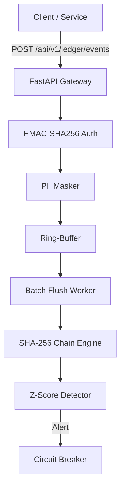

# ChronosLedger

ChronosLedger ist ein revisionssicheres Audit- & Incident-Logging-Gateway mit kryptografischer Manipulationserkennung, Echtzeit-Dashboard und automatischer Anomalie-Erkennung.

## 🚀 Features

- **Revisionssicherheit:** Kryptografische Hash-Verkettung (SHA-256) jedes Log-Eintrags zum Vorgänger.
- **Compliance:** DSGVO-konforme PII-Maskierung (E-Mail, IP, Secrets) und GoBD-Audit-Trail.
- **Performance:** Asynchrone In-Memory Ingestion-Queue (Ring-Buffer) für hohen Durchsatz.
- **Resilienz:** Circuit-Breaker für externe Webhooks und Dead-Letter-Queue (DLQ).
- **Sicherheit:** Multi-Tenant API-Key-Authentifizierung mit timing-sicherer HMAC-SHA256 Validierung.
- **Anomalie-Erkennung:** Statistische Ausreißer-Erkennung (Z-Score) in Echtzeit.

## 🏗️ Architektur



## 🛠️ Installation

1. **Voraussetzungen:** Python 3.11+
2. **Abhängigkeiten:**
   ```bash
   pip install -r requirements.txt
   ```
3. **Starten:**
   ```bash
   uvicorn app.main:app --reload
   ```

## 📚 API-Dokumentation

| Methode | Endpunkt | Beschreibung |
| :--- | :--- | :--- |
| `POST` | `/api/v1/ledger/events` | Log-Eintrag senden |
| `GET` | `/api/v1/ledger/verify/{id}` | Integritätsprüfung eines Eintrags |
| `GET` | `/api/v1/gdpr/export/{id}` | DSGVO-konformer Datenexport |

## ⚖️ Architektur-Entscheidungen (ADR)

- **ADR-0001:** Append-Only Ledger mit SHA-256 Verkettung.
- **ADR-0002:** Asynchroner In-Memory Ring-Buffer für Ingestion.

## 📝 Changelog

### [0.1.0] - 2024-05-22
- Initiales Release des ChronosLedger Gateways.
- Implementierung der SHA-256 Hash-Kette.
- Basis-API für Ingestion und Verifikation.
- Integration von PII-Maskierung und Ring-Buffer.
