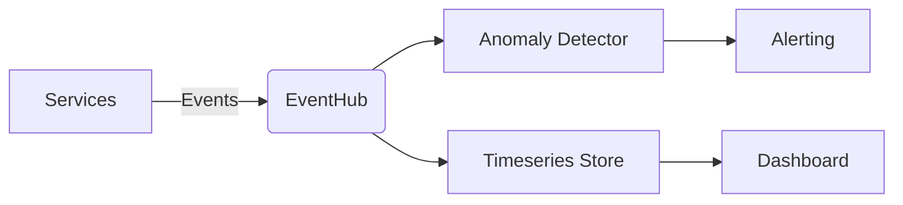

# ChronosPulse

[](https://opensource.org/licenses/MIT)
[](https://www.python.org/downloads/)
[](https://fastapi.tiangolo.com/)

ChronosPulse is a high-availability, intelligent observability and event-streaming platform designed for distributed microsystems. It features predictive anomaly detection and automated incident management.

## 🚀 Key Features
- **Real-time Event Streaming:** Low-latency metrics ingestion via REST and SSE.
- **Predictive Analytics:** Local statistical anomaly detection (Z-Score/EMA).
- **High Availability:** Decoupled event-driven architecture.
- **Accessibility First:** WCAG 2.2 AA compliant dashboard.

## 🏗️ Architecture Overview
ChronosPulse utilizes a decoupled architecture:
- **API Layer:** FastAPI (v0.128.0+)
- **Data Engine:** In-memory buffer with SQLite/DuckDB persistence.
- **ML Engine:** Scikit-learn based anomaly detection.



## ⚡ Quickstart

### Prerequisites
- Python 3.12+
- `pip`

### Installation
1. Clone the repository:
   ```bash
   git clone https://github.com/your-org/chronos-pulse.git
   cd chronos-pulse
   ```
2. Install dependencies:
   ```bash
   pip install -r requirements.txt
   ```
3. Run the application:
   ```bash
   uvicorn app.main:app --reload
   ```

## 📖 Documentation
- [ADR 0001: SSE and REST for Metrics](docs/adr/0001-server-sent-events-sse-und-rest-fuer-met.md)
- [ADR 0002: Local Statistical Model](docs/adr/0002-lokales-statistisches-modell-z-score-ema.md)

## 📝 Changelog

### [0.1.0] - 2025-05-15
- Initial project setup.
- Implemented core FastAPI backend with Pydantic v2.
- Added SSE support for real-time metrics.
- Integrated local anomaly detection pipeline.
- Established documentation structure (ADRs).

## 🛡️ License
Distributed under the MIT License. See `LICENSE` for more information.
