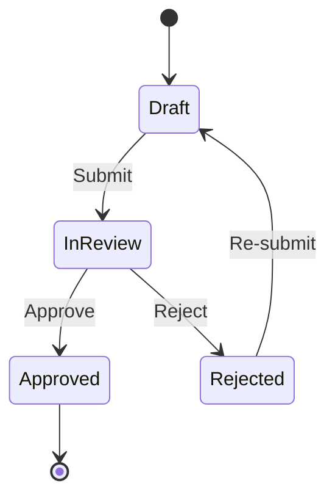

# ChronosVault

ChronosVault ist eine manipulationssichere, event-getriebene State-Machine-Engine für mehrstufige Genehmigungs- und Dokumenten-Workflows. Sie nutzt eine kryptographische Hash-Chain (SHA-256), um jeden Statusübergang und jede Aktion lückenlos und unveränderlich zu auditieren.

## 🚀 Features
- **Deterministische State-Machine**: Strikte Definition von Zuständen und Übergängen.
- **Kryptographischer Audit-Trail**: Verkettete SHA-256 Hashes für jeden Log-Eintrag.
- **Vier-Augen-Prinzip**: Unterstützung für rollenbasierte Genehmigungsprozesse.
- **DDD-Ansatz**: Klare Trennung von Definition, Instanz und Ausführung.

## 🏗️ Architektur



## 🛠️ Installation

```bash
pip install -r requirements.txt
python -m uvicorn app.main:app --reload
```

## 📡 API Spezifikation

### Workflow Definition erstellen
`POST /api/workflows/definitions`

```json
{
  "name": "Rechnungsfreigabe",
  "states": ["Draft", "InReview", "Approved", "Rejected"],
  "transitions": [
    {"from_state": "Draft", "to_state": "InReview", "trigger": "submit"},
    {"from_state": "InReview", "to_state": "Approved", "trigger": "approve"}
  ]
}
```

### Workflow Instanz erstellen
`POST /api/workflows/instances`

```json
{
  "definition_id": 1,
  "initial_payload": {"invoice_id": "INV-123"}
}
```

### Statusübergang ausführen
`POST /api/workflows/instances/{id}/transitions`

```json
{
  "trigger": "submit",
  "actor": "user_1"
}
```

## 🛡️ Audit-Trail Verifikation
Jeder Eintrag in der Datenbank enthält einen Hash, der den vorherigen Eintrag referenziert. Die Integrität kann über den Endpunkt `GET /api/workflows/instances/{id}/audit` geprüft werden.

## 📜 Changelog

### [0.1.0] - 2026-09-20
- Initiales Release der ChronosVault Engine.
- Implementierung der State-Machine und Hash-Chain.
- Basis-API für Workflows und Audit-Logs.
