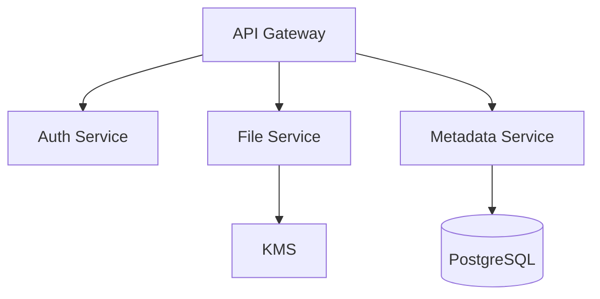

# CloudVault

CloudVault is a secure, production-ready platform for encrypted file sharing, tagging, and storage management.

## 🏗️ Architecture Overview

CloudVault follows a microservices architecture to ensure security and scalability.



### ADRs
- [0001: Microservices Architecture](docs/adr/0001-microservices-statt-monolith-f-r-cloudva.md)
- [0002: UUID v4 for Primary Keys](docs/adr/0002-uuid-v4-f-r-prim-rschl-ssel.md)
- [0003: PostgreSQL for Metadata Management](docs/adr/0003-postgresql-f-r-metadaten-management.md)

## 🚀 Getting Started

### Prerequisites
- Python 3.9+
- Node.js 18+
- PostgreSQL 14+

### Database Setup
```bash
psql -d cloudvault -f schema.sql
```

### Backend Setup
```bash
cd app
pip install -r requirements.txt
python main.py
```

### Frontend Setup
```bash
cd ../
npm install
npm start
```

## 🔐 API Highlights
- `POST /api/v1/files/upload`: Secure file upload with AES-256-GCM encryption.
- `GET /api/v1/files/{id}/download`: Retrieve presigned download URLs.
- `POST /api/v1/shares`: Generate temporary, time-bound access links.

## 📝 Changelog

### [0.1.0] - 2023-10-27
- Initial release of CloudVault core components.
- Implemented AuthContext and Dashboard UI.
- Established PostgreSQL schema and backend service structure.
