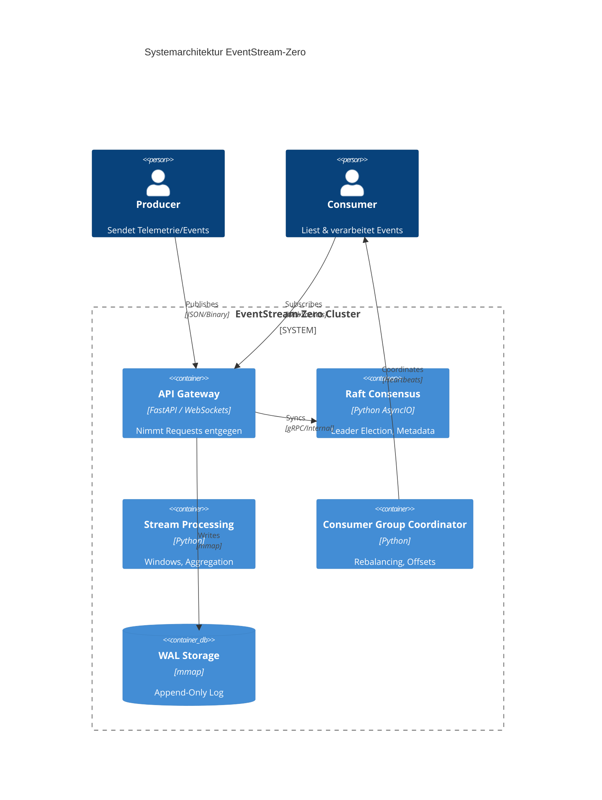

# Architektur-Dokumentation: EventStream-Zero

## 1. Übersicht
EventStream-Zero ist eine hochperformante, verteilte Event-Streaming-Plattform, die auf Python 3.14 mit AsyncIO und FastAPI basiert. Sie bietet strikte Order-Garantie, resilientes Failover und In-Memory Stream Processing.

## 2. Systemdiagramm

## 3. API-Spezifikation (REST)

### Topics
*   `POST /api/v1/topics`: Erstellt ein neues Topic.
*   `POST /api/v1/topics/{topic}/publish`: Publiziert eine Nachricht.
    *   Payload: `{"correlation_id": "uuid", "payload": "..."}`
*   `GET /api/v1/topics/{topic}/messages`: Liest Nachrichten (paginiert).

### WebSockets
*   `/ws/live`: Live-Stream für Consumer.
    *   Protokoll: JSON-Frames mit Offset-Tracking.

## 4. Kernkomponenten
*   **WAL (Write-Ahead-Log):** Nutzt `mmap` für Zero-Copy-Performance. Segmentiertes Speichermodell.
*   **Consumer Groups:** In-Memory Koordination mit automatischem Rebalancing und Heartbeat-Monitoring.
*   **Stream Processing:** Unterstützt Tumbling, Sliding und Session Windows.

## 5. ADR Referenzen
*   [0001-memory-mapped-mmap-append-only-wal-f-r-s.md](docs/adr/0001-memory-mapped-mmap-append-only-wal-f-r-s.md)
*   [0002-integrierter-raft-konsens-statt-externem.md](docs/adr/0002-integrierter-raft-konsens-statt-externem.md)
*   [0003-hybrides-api-design-grpc-core-fastapi-re.md](docs/adr/0003-hybrides-api-design-grpc-core-fastapi-re.md)
