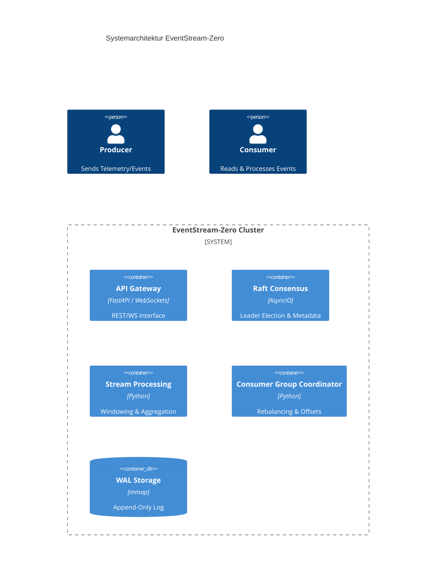

# EventStream-Zero

[](https://opensource.org/licenses/MIT)
[](https://www.python.org/downloads/)
[]()

EventStream-Zero is a high-performance, distributed event-streaming and stream-processing platform built for financial and IoT telemetry data. It combines the reliability of append-only WAL storage with the flexibility of real-time stream processing.

## 🚀 Key Features

*   **Core Storage:** Append-only Write-Ahead-Log (WAL) using `mmap` for zero-copy performance.
*   **Stream Processing:** In-memory engine supporting Tumbling, Sliding, and Session windows.
*   **Consumer Groups:** Automated rebalancing, heartbeat monitoring, and persistent offset tracking.
*   **Resilience:** Built-in DLQ with exponential backoff and circuit-breaker patterns.
*   **API-First:** FastAPI-based REST and WebSocket interfaces for management and real-time monitoring.

## 🛠️ Prerequisites

*   Python 3.14+
*   `pip`

## 📦 Installation

1. Clone the repository:
   ```bash
   git clone https://github.com/your-org/eventstream-zero.git
   cd eventstream-zero
   ```

2. Install dependencies:
   ```bash
   pip install -r requirements.txt
   ```

## 🏃 Usage

Start the EventStream-Zero server:

```bash
python -m app.main
```

The API will be available at `http://localhost:8000`.

## 🏗️ Architecture

EventStream-Zero follows a modular design with a focus on high throughput and low latency.



## 📝 Changelog

### [0.1.0] - 2025-05-15
*   Initial release of core components.
*   Implemented `mmap`-based WAL storage engine.
*   Implemented Consumer Group coordination and offset tracking.
*   Added basic FastAPI structure and static frontend.

## 📄 License

Distributed under the MIT License. See `LICENSE` for more information.
