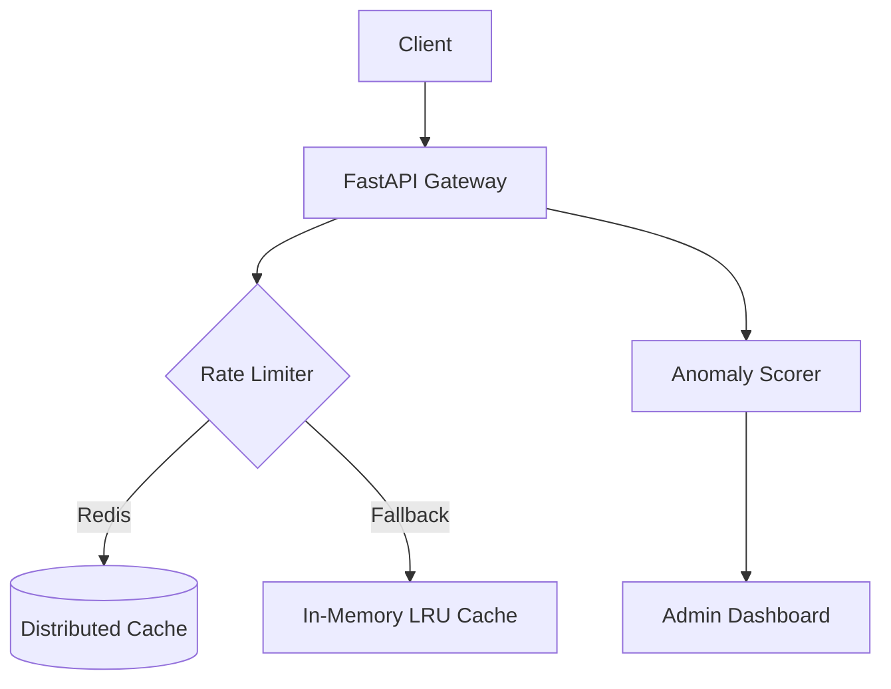

# HyperionSentinel

HyperionSentinel is a high-performance, fault-tolerant Security & Traffic-Shaping engine for mission-critical microservices. It features dynamic sliding-window rate-limiting, adaptive DDoS protection heuristics, cryptographic token validation, and an interactive real-time admin dashboard.

## 🚀 Key Features

*   **Sliding-Window Rate-Limiting:** Asynchronous, high-precision traffic shaping.
*   **Resilient Architecture:** Automatic fallback from Redis to In-Memory LRU/TTL cache upon service degradation.
*   **Adaptive Security:** Real-time anomaly detection using Z-Score EMA heuristics.
*   **Accessible Dashboard:** WCAG 2.2 AA compliant real-time monitoring interface.
*   **Production-Ready:** FastAPI-based with Pydantic V2 configuration.

## 🛠️ Quick Start

### Prerequisites
*   Python 3.11+
*   Redis (for distributed state)

### Installation
```bash
pip install -r requirements.txt
```

### Running the Application
```bash
# Start the server
python -m uvicorn app.main:app --reload
```

The dashboard will be available at `http://localhost:8000/static/index.html`.

## 🏗️ Architecture

HyperionSentinel follows a modular architecture designed for high availability.



## 📜 ADRs (Architecture Decision Records)

1.  [Sliding Window Counter vs. Token Bucket](docs/adr/0001-sliding-window-counter-statt-token-bucke.md)
2.  [In-Memory Fallback Cache vs. Distributed State](docs/adr/0002-in-memory-fallback-cache-statt-reinem-di.md)
3.  [Z-Score EMA for Real-time Anomaly Detection](docs/adr/0003-adr-0003-z-score-ema-f-r-echtzeit-anomal.md)

## 📄 API Documentation
Refer to `interface_contract.json` for the full module interface contract.

## 📝 Changelog

### [0.1.0] - 2025-05-22
*   Initial release of HyperionSentinel core engine.
*   Implemented Sliding-Window Rate-Limiter with Redis/In-Memory fallback.
*   Added Z-Score EMA anomaly detection.
*   Integrated WCAG 2.2 compliant dashboard.
