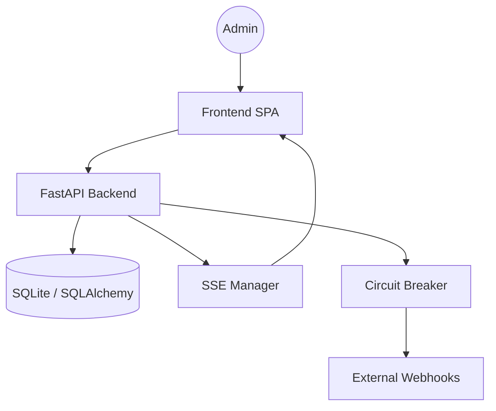

# IncidentPulse

IncidentPulse ist ein Echtzeit-Dashboard für Systemüberwachung und kollaboratives Incident-Management. Es bietet eine performante, asynchrone Backend-Infrastruktur und eine barrierefreie, moderne Vanilla-JS Single-Page-Application.

## 🏗️ Architektur
Das System folgt einer ereignisgesteuerten Architektur:
- **Backend:** FastAPI (Python 3.11+) mit `SQLAlchemy` (Async) und `SQLite`.
- **Frontend:** Vanilla JS, HTML5, CSS3 (Dark Mode).
- **Echtzeit-Updates:** Server-Sent Events (SSE) für Live-Incident-Feeds.
- **Resilience:** Integrierter Circuit Breaker für externe Webhook-Integrationen.



## 🚀 Installation & Setup

### Voraussetzungen
- Python 3.11+
- `pip`

### Lokale Entwicklung
1. Repository klonen:
   ```bash
   git clone <repo-url>
   cd incident-pulse
   ```

2. Abhängigkeiten installieren:
   ```bash
   pip install -r requirements.txt
   ```

3. Anwendung starten:
   ```bash
   uvicorn app.main:app --reload
   ```

4. Zugriff unter `http://127.0.0.1:8000`.

## 🧪 Testing
Das Projekt nutzt `pytest` für das Backend und `Playwright` für E2E-Frontend-Tests.
```bash
pytest tests/
```

## 📖 API-Dokumentation
Nach dem Start ist die interaktive API-Dokumentation unter `/docs` (Swagger UI) verfügbar.

## 📝 Changelog

### [0.1.0] - 2024-05-22
- Initiales Release
- Grundgerüst FastAPI & SQLite
- Vanilla-JS SPA mit Dark Mode
- SSE-Integration für Live-Updates
- Basis-Incident-Workflow (Triaged, In-Progress, Mitigated, Resolved)
