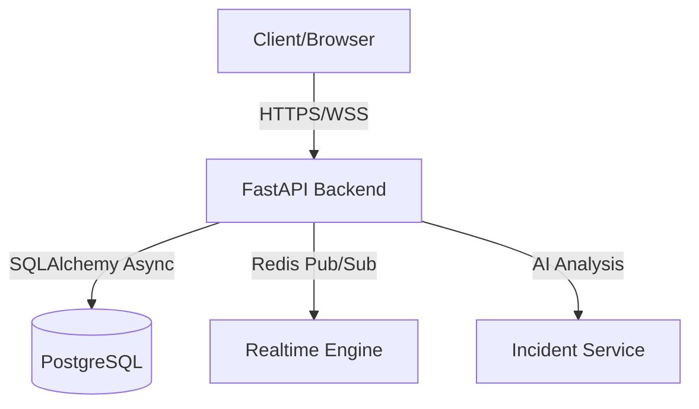

# LogiPulse

[](https://opensource.org/licenses/MIT)
[](https://www.python.org/downloads/)
[](https://fastapi.tiangolo.com/)

LogiPulse ist eine AI-gestützte Plattform für Realtime API Observability und Incident Management. Das System erkennt Anomalien in API-Traffic und bietet automatisierte Empfehlungen zur Fehlerbehebung.

## 🏗️ Architektur



## 🚀 Features

- **Realtime Observability:** WebSocket-basierte Live-Visualisierung von API-Metriken.
- **AI-Anomaly Detection:** Automatische Erkennung von Latenz-Spikes und Fehlerraten.
- **Incident Management:** Rollenbasierte Verwaltung von Incidents.
- **Dark Mode UI:** Modernes, barrierefreies Dashboard (WCAG 2.2 AA).

## 🛠️ Installation & Setup

Voraussetzung: [Docker](https://www.docker.com/) und [Docker Compose](https://docs.docker.com/compose/) sind installiert.

1. **Repository klonen:**
   ```bash
   git clone https://github.com/logipulse/logipulse.git
   cd logipulse
   ```

2. **Umgebungsvariablen konfigurieren:**
   Erstelle eine `.env` Datei basierend auf der `.env.example`.

3. **Starten:**
   ```bash
   docker-compose up --build
   ```

## 📚 API-Schnittstellen

| Endpunkt | Methode | Beschreibung |
| :--- | :--- | :--- |
| `/api/v1/ingest` | `POST` | Ingestion von Trace-Daten |
| `/api/v1/ws/observability` | `WSS` | WebSocket-Stream für Live-Daten |
| `/api/v1/anomalies` | `GET` | Abruf erkannter Anomalien |

## 🛡️ Sicherheit
LogiPulse verwendet JWT-basierte Authentifizierung. Der `SECRET_KEY` wird durch Pydantic-Validatoren auf Komplexität und Mindestlänge (32 Zeichen) geprüft.

## 📝 Changelog

### [0.1.0] - 2026-09-10
- Initiales Release der Observability-Plattform.
- Implementierung der Pydantic-basierten Secret-Key-Validierung (ADR-0004).
- Setup der React-SPA mit Tailwind CSS.
- Integration von Redis Pub/Sub für Realtime-Daten (ADR-0005).
