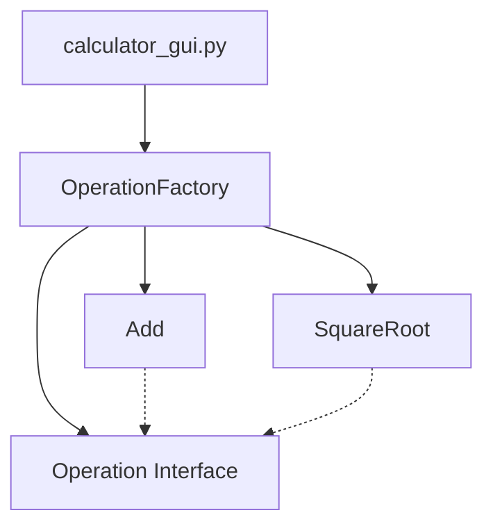

# Taschenrechner-Projekt

Ein erweiterbarer Taschenrechner mit strikter Trennung von Core-Logik und GUI-Layer.

## Architektur


## Erweiterung: Neue mathematische Funktionen hinzufügen

Um eine neue Funktion (z.B. `Multiplikation` oder `Potenz`) hinzuzufügen, folgen Sie diesen zwei Schritten:

### 1. Klasse in `calculator_core.py` definieren
Erstellen Sie eine neue Klasse, die von `Operation` erbt und die `execute`-Methode implementiert:

```python
class Multiply(Operation):
    def execute(self, a, b=None):
        return a * b
```

### 2. In `OperationFactory` registrieren
Fügen Sie das neue Mapping im `_operations`-Dictionary der `OperationFactory` hinzu:

```python
class OperationFactory:
    _operations = {
        "+": Add(),
        "*": Multiply(), # Neu registriert
        # ...
    }
```

Die GUI erkennt die neue Operation automatisch über das Factory-Interface.

## Changelog
- 2024-05-22: Initiales Projekt-Setup und Dokumentation der Erweiterungslogik.
