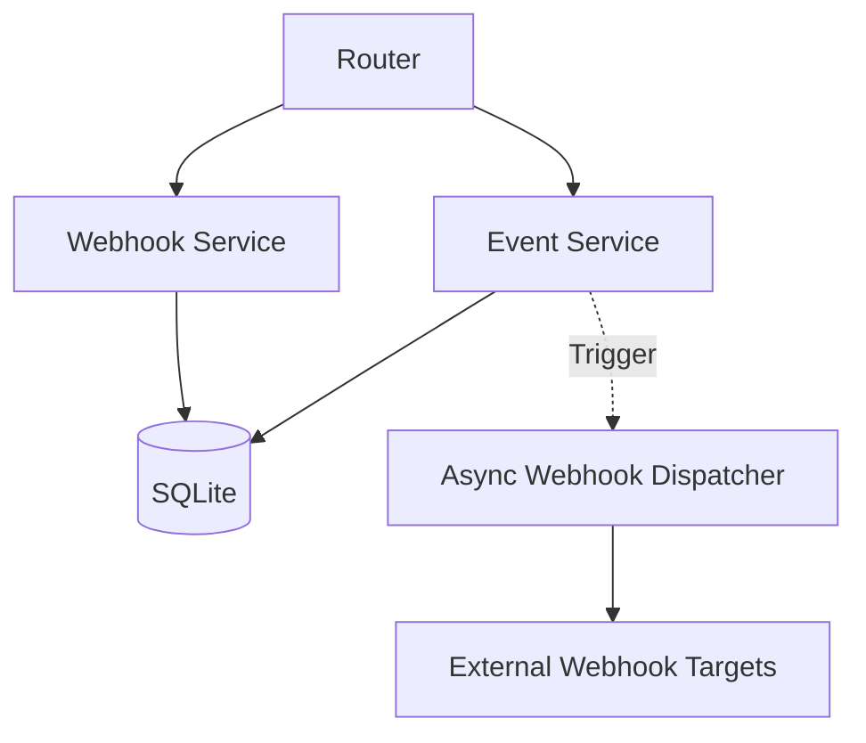

# nexus_flow

Ein produktionsreifer Event-Ingestion- und Stream-Service, gebaut mit FastAPI und SQLite.

## 🚀 Features
- **Event Ingestion:** Asynchrone Annahme von Events via REST API.
- **Webhook Subscriptions:** Automatische Weiterleitung von Events an registrierte Webhook-Endpunkte.
- **Sicherheit:** HMAC-Signatur-Verifizierung für Webhook-Payloads.
- **Robustheit:** Asynchroner Dispatcher mit Delivery-Status-Tracking.
- **Datenbank:** SQLite mit asynchroner Unterstützung (SQLAlchemy + aiosqlite).

## 🛠️ Tech Stack
- **Framework:** FastAPI
- **Datenbank:** SQLite (async)
- **ORM:** SQLAlchemy 2.0
- **Validierung:** Pydantic v2
- **Testing:** Pytest

## 📦 Installation

1. Repository klonen:
   ```bash
   git clone <repository-url>
   cd nexus_flow
   ```

2. Virtuelle Umgebung erstellen und Abhängigkeiten installieren:
   ```bash
   python -m venv venv
   source venv/bin/activate  # Windows: venv\Scripts\activate
   pip install -r requirements.txt
   ```

3. Anwendung starten:
   ```bash
   python main.py
   ```

## 📖 API Dokumentation

Die API ist unter `/docs` (Swagger UI) erreichbar, sobald der Server läuft.

### Wichtige Endpunkte
- `GET /health`: Systemstatus-Check.
- `POST /api/v1/events`: Neues Event einreichen.
- `GET /api/v1/events`: Liste aller Events abrufen.
- `GET /api/v1/events/{event_id}`: Details zu einem spezifischen Event.

## 🧪 Testing
Das Projekt enthält eine vollständige Test-Suite. Führe sie mit folgendem Befehl aus:
```bash
pytest
```

## 🏗️ Architektur


## 📝 Changelog

### [0.1.0] - 2026-09-22
- Initiales Release: Event-Ingestion- und Stream-Service Struktur.
- Implementierung von FastAPI-Routen, SQLite-Integration und Webhook-Dispatcher.
