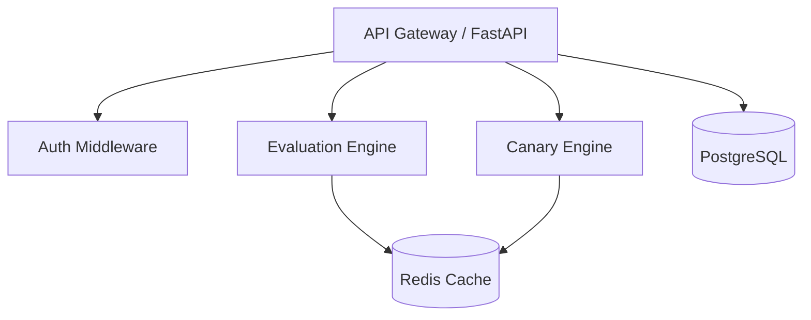

# NexusForge

NexusForge is a high-performance, multi-tenant feature flagging, dynamic configuration, and canary deployment system designed for modern distributed architectures.

## 🏗️ Architecture

NexusForge utilizes a decoupled architecture to ensure low-latency flag evaluation and robust canary management.



## 🚀 Features

- **Multi-Tenancy:** Strict tenant isolation via JWT/API-Keys.
- **High-Performance Evaluation:** In-memory caching with Redis Pub/Sub invalidation.
- **Canary & Killswitch:** Automated rollback based on error-rate/latency thresholds.
- **Real-time Streaming:** WebSocket/SSE support for audit logs and metrics.
- **RBAC:** Role-based access control (Admin, Developer, Viewer, Auditor).

## 🛠️ Setup & Installation

### Prerequisites
- Python 3.11+
- Redis
- PostgreSQL

### Installation
```bash
# Clone the repository
git clone https://github.com/your-org/nexusforge.git
cd nexusforge

# Install dependencies
pip install -r requirements.txt

# Run the application
uvicorn app.main:app --reload
```

## 🔌 API Documentation

| Endpoint | Method | Description |
|---|---|---|
| `/api/v1/flags` | GET/POST | Manage feature flags |
| `/api/v1/flags/{key}` | GET/PUT/DELETE | Specific flag operations |
| `/api/v1/auth/login` | POST | Authenticate and get JWT |

## 📝 Changelog

### [0.1.0] - 2023-10-27
- Initial project structure setup.
- Core models (Tenant, FeatureFlag, AuditLog) implemented.
- Repository pattern established for data access.
- Frontend foundation initiated with React/TypeScript/Vite.
