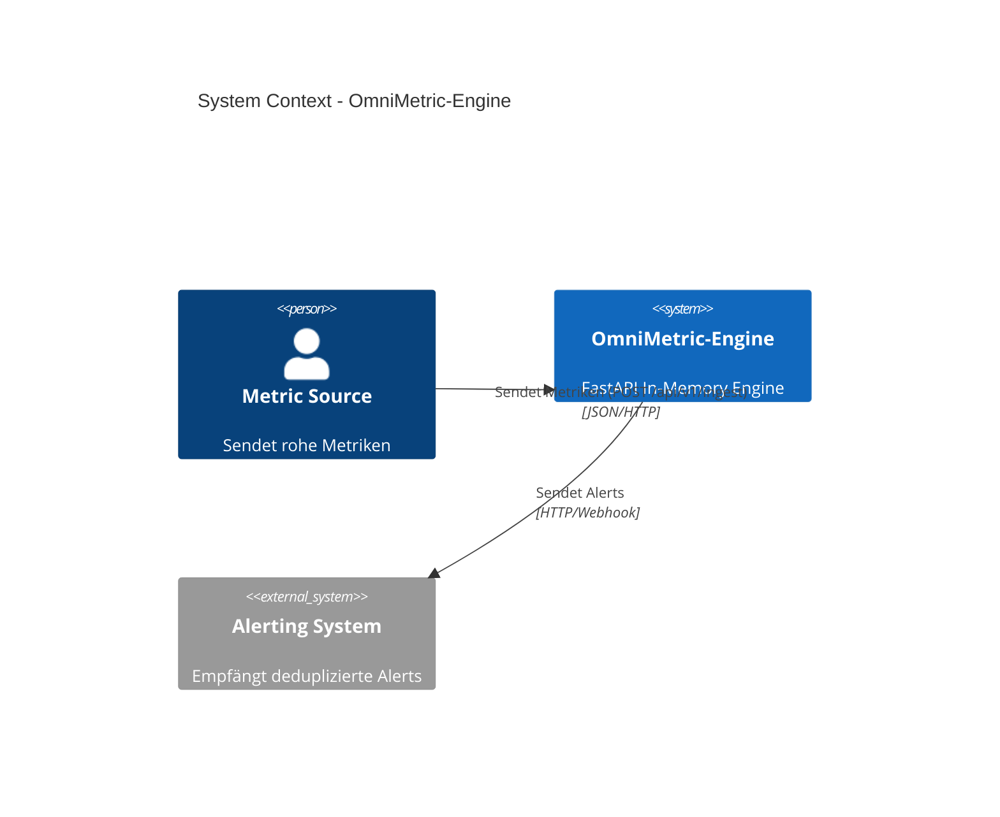

# OmniMetric-Engine

Echtzeitfähige Time-Series-Ingestion-, Aggregations- und Anomalie-Erkennungs-Engine mit In-Memory-Sliding-Window.

## 🏗️ Architektur



## 📊 Anomalie-Erkennung (Z-Score)

Die Engine erkennt Anomalien basierend auf der statistischen Abweichung vom gleitenden Mittelwert:

$$Z = \frac{x - \mu}{\sigma}$$

*   $x$: Aktueller Wert
*   $\mu$: Mittelwert des gleitenden Fensters
*   $\sigma$: Standardabweichung des gleitenden Fensters

Ein Alert wird ausgelöst, wenn $|Z| > 3.0$ (3-Sigma-Regel), was statistisch gesehen Ausreißer identifiziert, die außerhalb von 99,7% der Normalverteilung liegen.

## 🚀 Installation & Start

```bash
pip install -r requirements.txt
uvicorn app.main:app --reload
```

## 📡 API Endpunkte

| Methode | Endpunkt | Beschreibung |
| :--- | :--- | :--- |
| `POST` | `/api/v1/ingest` | Metrik-Punkt senden |
| `GET` | `/api/v1/stats/{name}` | Aggregierte Statistiken (p50, p95, p99) |
| `GET` | `/api/v1/alerts` | Liste der aktiven Alerts |

### Benchmark Request
```bash
curl -X POST "http://localhost:8000/api/v1/ingest" \
     -H "Content-Type: application/json" \
     -d '{"name": "cpu_usage", "value": 85.5}'
```

## 📝 Changelog

### [0.1.0] - 2025-05-15
- Initial release of OmniMetric-Engine.
- In-memory ring buffer implementation.
- Z-Score based anomaly detection worker.
- FastAPI endpoints for ingestion and stats.
