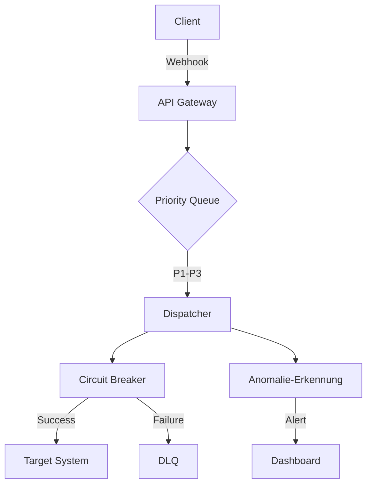

# OmniQueue

OmniQueue ist ein robustes, verteiltes Event- & Webhook-Dispatching Gateway, das für hohe Zuverlässigkeit, DSGVO-Konformität und Echtzeit-Überwachung entwickelt wurde.

## 🚀 Features

- **Asynchrone Engine:** Gebaut auf FastAPI und SQLAlchemy 2.0 für maximale Performance.
- **Resilienz:** Integrierter Circuit-Breaker mit konfigurierbarem Exponential-Backoff und Dead-Letter-Queue (DLQ).
- **Anomalie-Erkennung:** Statistische Ausreißer-Erkennung (Z-Score) für Latenz- und Fehlerraten-Spikes.
- **DSGVO-Konform:** Automatische Daten-Retention-Policies und Audit-Trails.
- **Sicherheit:** Multi-Tenant API-Key Authentifizierung mit HMAC-SHA256.
- **Modernes Dashboard:** Responsives, barrierefreies UI (WCAG 2.2 AA) mit Dark-Mode.

## 🏗️ Architektur

OmniQueue nutzt eine asynchrone Architektur, um Event-Durchsatz zu maximieren und Zielsysteme vor Überlastung zu schützen.



## ⚡ Schnellstart

1. **Installation:**
   ```bash
   pip install -r requirements.txt
   ```

2. **Konfiguration:**
   Passen Sie die Umgebungsvariablen in `.env` an (Datenbank-URL, API-Keys).

3. **Start:**
   ```bash
   python -m app.main
   ```

## 📚 API-Dokumentation

Die API ist als REST-Schnittstelle konzipiert.

| Methode | Endpunkt | Beschreibung |
| :--- | :--- | :--- |
| `POST` | `/v1/events` | Event in die Queue einreihen |
| `GET` | `/v1/events/{id}` | Status eines Events abrufen |
| `DELETE` | `/v1/tenants/{id}/data` | DSGVO-konforme Datenlöschung |

*Authentifizierung erfolgt über den Header: `X-API-KEY: <your-key>`*

## 🛠️ Tech-Stack

- **Backend:** Python, FastAPI, SQLAlchemy 2.0, aiosqlite
- **Frontend:** HTML5, CSS (semantisch), Vanilla JS
- **Monitoring:** Statistische Analyse (Z-Score)

## 📜 Changelog

### [0.1.0] - 2024-05-22
- Initiales Release
- Architektur-Entscheidungen (ADR) dokumentiert
- Basis-Backend-Struktur implementiert
- Frontend-Dashboard (MVP) mit Barrierefreiheits-Fokus erstellt
