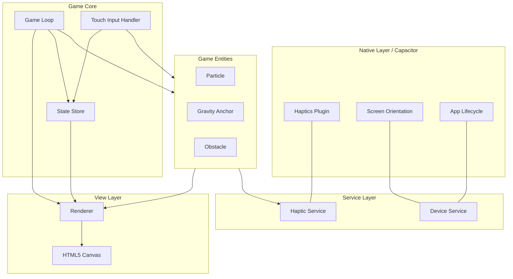

# Architektur-Blueprint: Orbit Tether (Chroma Orbit)

## 1. Architektur-Überblick
Die Anwendung folgt einer modularen, komponenten-basierten Architektur für ein Mobile-First HTML5-Canvas-Spiel, verpackt mit Capacitor. 
- **Core Engine:** Ein leichtgewichtiger, maßgeschneiderter Game-Loop basierend auf `requestAnimationFrame` mit Delta-Time-Berechnung sorgt für flüssige 60/120 FPS.
- **State Management:** Ein zentraler, reaktiver Store verwaltet den Spielzustand (Menü, In-Game, Game Over), Scores und Einstellungen.
- **Capacitor Services:** Native Funktionen (Haptik, Screen Orientation, App-Lifecycle) werden in Service-Klassen gekapselt, um eine saubere Trennung zwischen Spiellogik und Plattform-APIs zu gewährleisten.
- **Rendering:** Direktes Zeichnen auf das HTML5 `<canvas>`-Element mit dynamischer Skalierung (Device Pixel Ratio) für gestochen scharfe Darstellung auf allen Displays.

## 2. Systemdiagramm



## 3. Komponenten-Definition

| Komponente | Verantwortlichkeit |
|------------|-------------------|
| **GameLoop** | Steuert `requestAnimationFrame`, berechnet `deltaTime`, ruft `update()` und `draw()` auf. |
| **StateStore** | Verwaltet globalen Zustand (Score, Highscore, GameState: MENU, PLAYING, GAMEOVER). |
| **InputHandler** | Verarbeitet `touchstart`, `touchend`, `touchcancel` und mappt sie auf Spielaktionen (Ankern, Loslassen). |
| **Renderer** | Kapselt den Canvas-2D-Kontext, handhabt Resize-Events und Device-Pixel-Ratio-Skalierung. |
| **HapticService** | Kapselt `@capacitor/haptics` für haptisches Feedback (z.B. beim Ankern oder Kollision). |
| **DeviceService** | Kapselt `@capacitor/screen-orientation` (Lock auf Portrait) und `@capacitor/app` (Pause/Resume). |
| **Particle** | Spieler-Entität: Position, Geschwindigkeit, Physik (Tangentialflug, Kreisbahn). |
| **AnchorManager** | Spawnt und verwaltet Gravitations-Ankerpunkte im Level. |

## 4. Ordnerstruktur & Schnittstellen

```text
src/
├── core/
│   ├── GameLoop.ts       # Delta-Time & RAF
│   ├── InputHandler.ts   # Touch Events
│   ├── Renderer.ts       # Canvas Setup & Scaling
│   └── StateStore.ts     # Reaktiver Zustand
├── entities/
│   ├── Particle.ts       # Spieler
│   ├── Anchor.ts         # Gravitationspunkte
│   └── Obstacle.ts       # Hindernisse
├── services/
│   ├── HapticService.ts  # Capacitor Haptics
│   └── DeviceService.ts  # Capacitor App/Screen
├── utils/
│   └── MathUtils.ts      # Vektor-Mathematik, Kollisionserkennung
└── main.ts               # Entry Point, Bootstrapping
```

## 5. Datenmodell-Überblick

- **GameState:** `enum { MENU, PLAYING, PAUSED, GAME_OVER }`
- **Vector2D:** `{ x: number, y: number }`
- **ParticleState:** Position (Vector2D), Velocity (Vector2D), Radius, Color, isAnchored (boolean), currentAnchor (Anchor | null).
- **StoreState:** `{ state: GameState, score: number, highscore: number, soundEnabled: boolean }`

## 6. Technologie-Entscheidungen (ADRs)
- **HTML5 Canvas 2D API statt WebGL/Phaser:** Für dieses simple, geometrische Spiel (Kreise, Linien, Partikel) ist die native 2D API performant genug, reduziert die Bundle-Size drastisch und minimiert externe Abhängigkeiten.
- **Capacitor statt Cordova/React Native:** Bietet moderne, nahtlose Integration in Web-Workflows (Vite) und einfachen Zugriff auf native APIs via Plugins.
- **Zentraler Singleton-Store statt Redux:** Ein leichtgewichtiges Observer-Pattern reicht für die wenigen globalen Zustände völlig aus und vermeidet Overhead im Game-Loop.

## 7. Anweisungen für das Team
- **Frontend/Game-Entwickler:** Implementiere den `GameLoop` strikt mit `deltaTime`, um Framerate-Unabhängigkeit zu garantieren. Nutze `window.devicePixelRatio` im `Renderer`, um unscharfe Kanten auf Retina-Displays zu vermeiden.
- **Mobile/Capacitor-Entwickler:** Konfiguriere die App so, dass sie strikt im Portrait-Modus läuft (`DeviceService`). Reagiere auf `appStateChange` (Pause/Resume), um den Game-Loop bei Hintergrund-Wechsel zu pausieren.

## 8. Risiken & Hinweise
- **Performance-Drops durch Garbage Collection:** Vermeide die Instanziierung neuer Objekte (z.B. Vektoren) innerhalb der `update()`-Schleife. Nutze Object-Pooling für Partikel-Effekte.
- **Touch-Latenz:** Binde Event-Listener mit `{ passive: false }` und rufe `preventDefault()` auf, um natives Scrollen/Zoomen zu unterbinden und die Reaktionszeit zu minimieren.
- **Capacitor-Plugins im Browser:** Stelle sicher, dass alle Services Fallbacks für den Web-Browser haben, damit das Spiel lokal via `vite dev` ohne Emulator testbar bleibt.