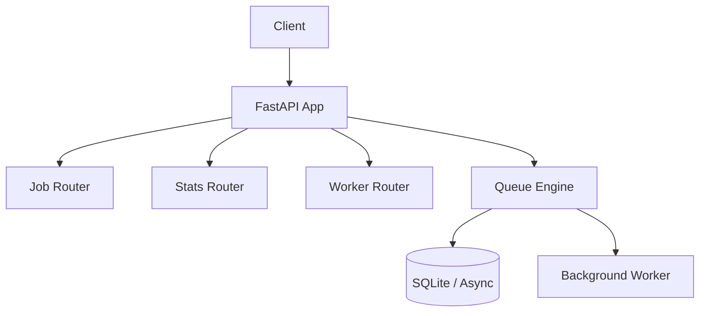

# pulse_queue

Ein hochperformanter, asynchroner Background-Job- & Queue-Service, entwickelt mit FastAPI und Python.

## 🚀 Architektur

`pulse_queue` nutzt eine modulare Architektur, um Job-Verarbeitung, API-Schnittstellen und System-Metriken sauber zu trennen.



## 🛠️ Installation

1. **Voraussetzungen:** Python 3.11+
2. **Installation:**
   ```bash
   pip install -r requirements.txt
   ```
3. **Start:**
   ```bash
   python -m uvicorn app.main:app --reload
   ```

## 🔑 API-Authentifizierung

Alle Endpunkte erfordern einen API-Key im Header:
`X-API-Key: <dein-secret-key>`

## 📡 API-Endpunkte

### Jobs verwalten
- **POST** `/api/v1/jobs`: Job erstellen
  ```bash
  curl -X POST http://localhost:8000/api/v1/jobs \
       -H "X-API-Key: secret" \
       -H "Content-Type: application/json" \
       -d '{"job_type": "email_dispatch", "priority": 1, "payload": {"to": "test@example.com"}}'
  ```
- **GET** `/api/v1/jobs`: Liste aller Jobs
- **GET** `/api/v1/jobs/{job_id}`: Job-Details abrufen
- **POST** `/api/v1/jobs/{job_id}/cancel`: Job abbrechen

### System & Metriken
- **GET** `/api/v1/stats`: Queue-Statistiken
- **GET** `/api/v1/health`: System-Healthcheck
- **GET** `/api/v1/workers/status`: Worker-Status

## 📝 Changelog

### [0.1.0] - 2026-09-22
- Initiales Release
- Implementierung der Kern-Queue-Logik
- FastAPI-Endpunkte für Jobs, Stats und Worker
- Asynchroner Background-Worker mit Prioritätssteuerung
