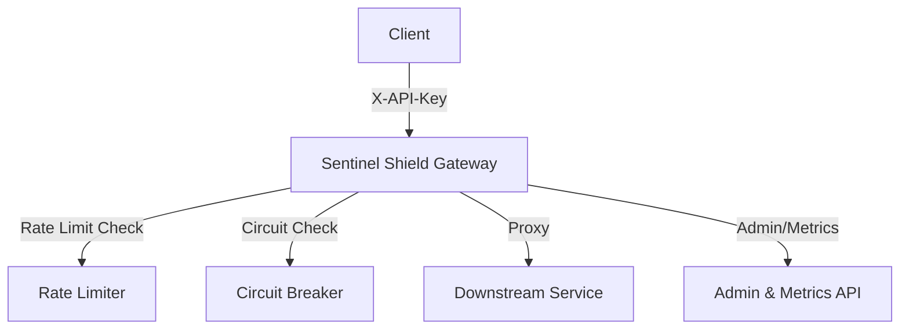

# Sentinel Shield

Sentinel Shield ist ein produktionsreifes, intelligentes Resilience- und Rate-Limiting-Gateway, entwickelt mit FastAPI. Es schützt Downstream-Services durch robuste Mechanismen wie Token-Bucket-Rate-Limiting und Circuit-Breaker-Muster.

## 🚀 Features

- **Rate Limiting:** Sliding-Window-Algorithmus pro API-Key.
- **Circuit Breaker:** Automatischer Schutz bei Ausfällen (Zustände: `closed`, `open`, `half_open`).
- **Sicherheit:** API-Key-Validierung, CORS-Schutz und Trusted-Host-Middleware.
- **Observability:** Prometheus-kompatible Metriken und Health-Checks.
- **Admin-API:** Manuelle Steuerung der Circuit-Breaker-Zustände.

## 🛠️ Architektur



## 📦 Installation

```bash
# Repository klonen
git clone <repository-url>
cd sentinel_shield

# Abhängigkeiten installieren
pip install -r requirements.txt

# Starten
uvicorn app.main:app --reload
```

## 📡 API Endpunkte (Prefix: `/api/v1`)

| Methode | Endpunkt | Beschreibung |
| :--- | :--- | :--- |
| POST | `/api/v1/dispatch` | Leitet Anfrage an Downstream weiter (mit Schutz) |
| GET | `/api/v1/health` | System-Gesundheitsstatus |
| GET | `/api/v1/circuits` | Status aller Circuit Breaker |
| POST | `/api/v1/circuits/{service}/reset` | Manueller Reset eines Circuit Breakers |
| GET | `/api/v1/metrics` | System-Metriken |

### Beispiel: Dispatch Request
```bash
curl -X POST http://localhost:8000/api/v1/dispatch \
     -H "X-API-Key: secret-key" \
     -H "Content-Type: application/json" \
     -d '{"service_name": "auth-service", "path": "/login", "method": "post"}'
```

## 📝 Changelog

### [0.1.0] - 2026-09-22
- Initiales Release des Sentinel Shield Gateways.
- Implementierung von Rate-Limiter und Circuit-Breaker.
- API-Key-Sicherheit und CORS-Konfiguration.
- Admin- und Metrik-Endpunkte integriert.
