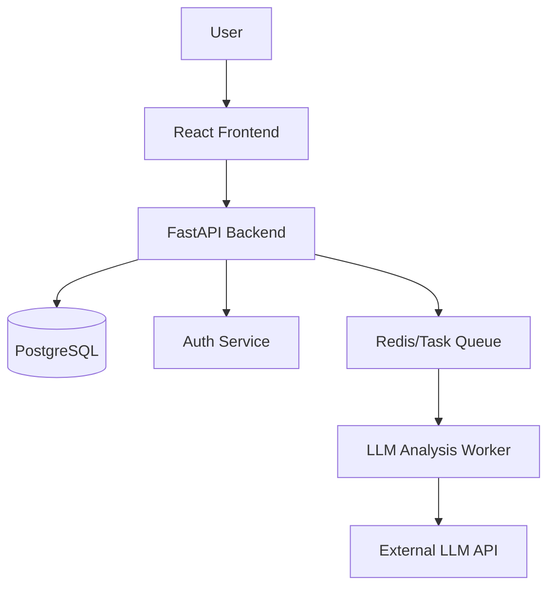

# SmartReview AI - Architektur-Blueprint

## 1. Architektur-Überblick
SmartReview AI ist eine Micro-SaaS-Plattform, die auf einer **Async-First FastAPI-Backend-Architektur** und einem **React-Frontend** basiert. Wir nutzen eine **Event-Driven-Komponente** für die KI-gestützte Analyse von Kundenfeedback, um die Antwortzeiten der API zu entkoppeln.

## 2. Systemdiagramm (Mermaid)

## 3. Komponenten-Definition
| Komponente | Verantwortung | Technologie |
| :--- | :--- | :--- |
| **API Gateway** | Routing, Auth, CORS | FastAPI |
| **Database** | Persistenz | PostgreSQL (SQLAlchemy/Alembic) |
| **Worker** | Asynchrone KI-Analyse | Celery + Redis |
| **Frontend** | UI/UX | React + Vite + Tailwind |

## 4. API-Schnittstellen
- `POST /api/v1/auth/login` - JWT Token Generierung
- `POST /api/v1/reviews` - Feedback einreichen
- `GET /api/v1/reviews` - Feedback-Liste abrufen
- `GET /api/v1/reviews/{id}/analysis` - KI-Analyse-Status abrufen

## 5. Datenmodell-Überblick
- **User**: id, email, password_hash, subscription_tier
- **Review**: id, user_id, content, language, sentiment_score, tags, created_at
- **Analysis**: id, review_id, summary, status

## 6. Technologie-Entscheidungen (ADRs)
- **ADR-001: FastAPI statt Django** - Für maximale Performance und native Async-Unterstützung.
- **ADR-002: PostgreSQL statt MongoDB** - Für relationale Datenintegrität bei Nutzer- und Review-Daten.
- **ADR-003: JWT-Auth statt Session-Cookies** - Für stateless Skalierbarkeit in einer Micro-SaaS-Umgebung.

## 7. Anweisungen für das Team
- **Backend**: Implementierung der `app/` Struktur. SSOT für Pydantic-Schemas.
- **Frontend**: Vite-Build-Pipeline in `frontend/` mit Output nach `app/static/`.
- **Security**: CORS-Middleware in `app/core/security.py` zwingend konfigurieren.

## 8. Risiken & Hinweise
- **KI-Kosten**: API-Calls zu LLMs müssen durch Caching (Redis) minimiert werden.
- **Latenz**: Asynchrone Verarbeitung ist für die User Experience kritisch.
