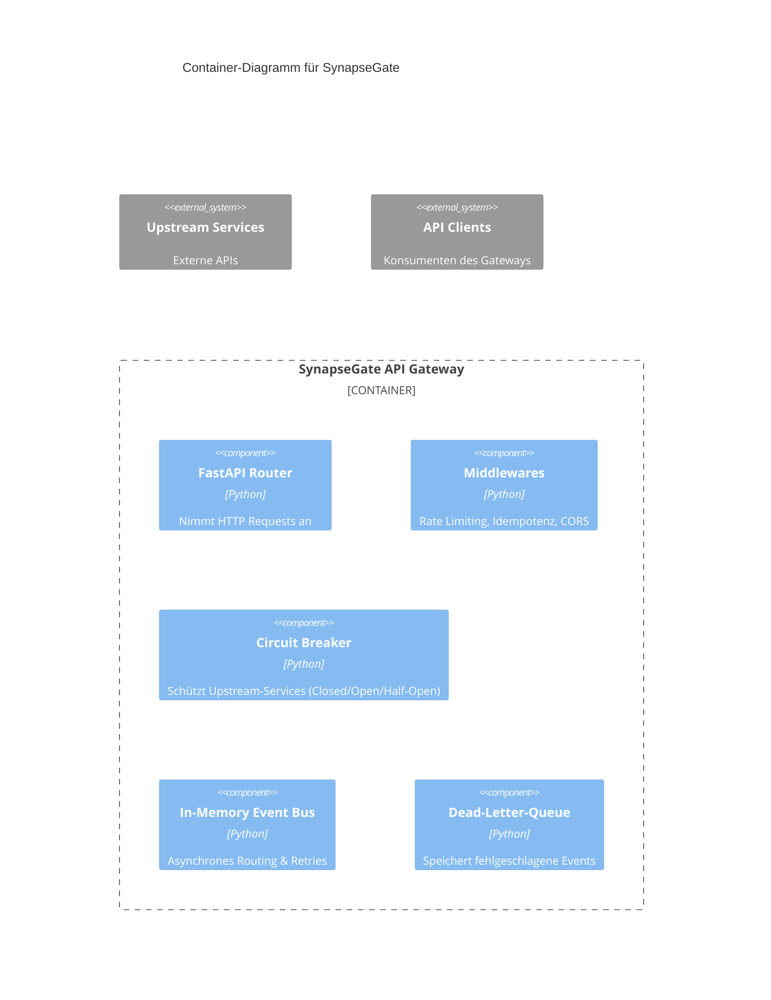

# SynapseGate

SynapseGate is a distributed, fault-tolerant event orchestration and API gateway built with Python 3.11+, FastAPI, and Pydantic v2. It features a robust circuit breaker, idempotency engine, and asynchronous event routing.

## 🏗️ Architecture



## 🚀 Features

- **Resilience:** In-Memory Circuit Breaker with exponential backoff.
- **Idempotency:** Reliable request handling using `X-Idempotency-Key`.
- **Event Bus:** Asynchronous event dispatching with integrated Dead-Letter-Queue (DLQ).
- **Rate Limiting:** Token-Bucket algorithm per client/IP.
- **Safety:** Structured JSON logging, zero-trust validation, and standardized error envelopes.

## 🛠️ Installation

```bash
pip install -r requirements.txt
```

## 📡 API Usage

### Health Check
```bash
curl -X GET http://localhost:8000/health
```

### Create Event (with Idempotency)
```bash
curl -X POST http://localhost:8000/api/v1/events \
  -H "Content-Type: application/json" \
  -H "X-Idempotency-Key: unique-request-id-123" \
  -d '{"event_type": "test_event", "payload": {"data": "value"}}'
```

### Get Dead-Letter-Queue
```bash
curl -X GET http://localhost:8000/api/v1/events/dlq
```

## 🧪 Testing

Run the test suite:
```bash
pytest
```

Run load tests (Locust):
```bash
locust -f tests/load/locustfile.py
```

## 📝 Changelog

### [0.1.0] - 2026-09-20
- Initial release of SynapseGate.
- Implementation of Core Engine (Circuit Breaker, Idempotency, Event Bus).
- Added API endpoints and health checks.
- Integrated load testing suite.
