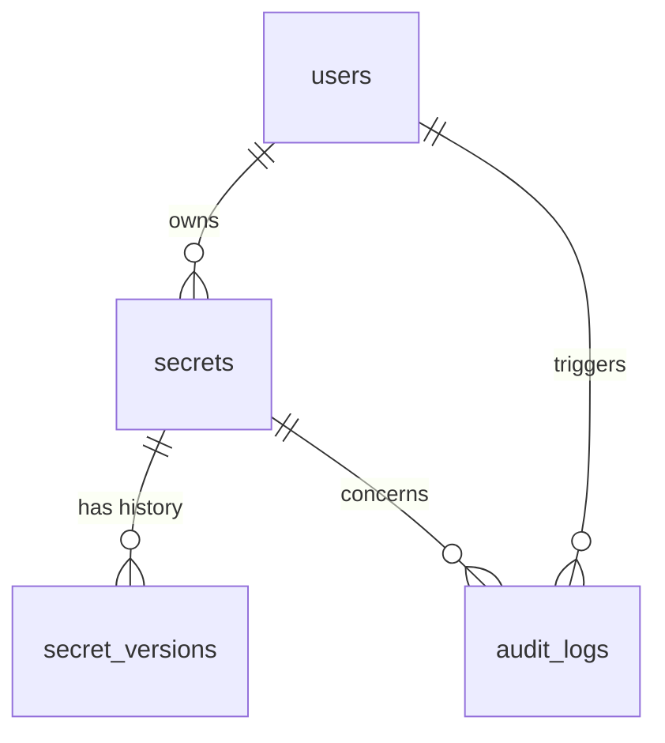

# VaultGuard

VaultGuard is a secure secret management and leak prevention service designed for high-security environments. It provides robust encryption, secret versioning, and audit logging to ensure sensitive data remains protected.

## 🏗️ Architecture

VaultGuard utilizes a modern, asynchronous stack:
- **Backend:** FastAPI (Python 3.11+)
- **Database:** PostgreSQL with Async SQLAlchemy 2.0
- **Security:** Envelope Encryption, JWT Authentication



## 🚀 Getting Started

### Prerequisites
- Python 3.11+
- PostgreSQL 15+

### Installation
1. Clone the repository:
   ```bash
   git clone https://github.com/your-org/vaultguard.git
   cd vaultguard
   ```
2. Install dependencies:
   ```bash
   pip install -r requirements.txt
   ```
3. Configure environment variables (copy `.env.example` to `.env` and update values).

### Running the Service
```bash
uvicorn app.main:app --reload
```

## 📚 API Documentation
Once running, the interactive API documentation is available at `/docs` (Swagger UI) or `/redoc` (ReDoc).

## 🔒 Security Features
- **Envelope Encryption:** Secrets are encrypted using unique data keys.
- **Audit Logging:** Every access and modification is logged.
- **Secret Versioning:** Full history of secret changes.

## 📝 Changelog

### [0.1.0] - 2024-05-22
- Initial project setup.
- Database schema definition (PostgreSQL/SQLAlchemy).
- Basic configuration management.
- ADRs for database and load testing framework.
